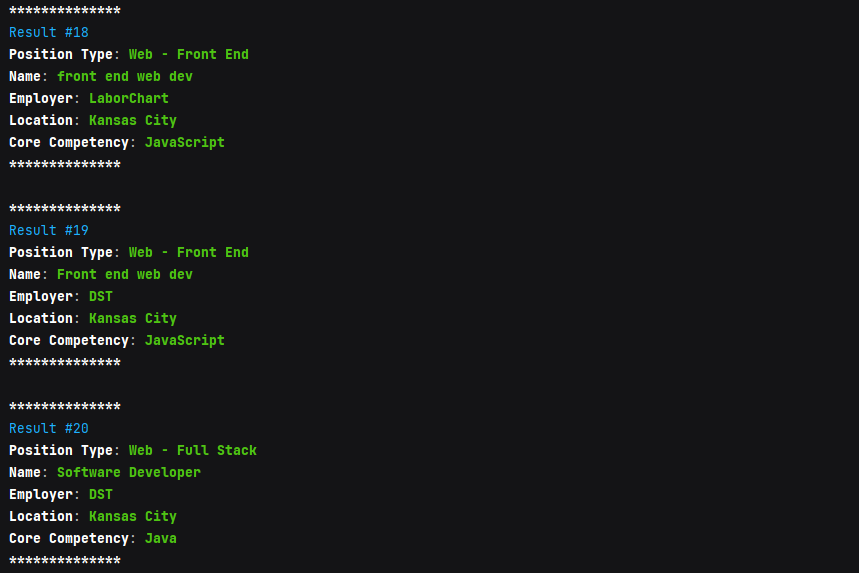

# Tech Jobs Console

This app allows the user to search for and list available IT jobs from a mock database (./resources/job_data.csv).
The app runs in the terminal/console of the user's computer. Once the app starts. the user is prompted
to select either to "Search" or "List" available jobs. 

Selecting the "Search" option allows the user to select a field to search on. Search fields include "All", "Position Type", "Employer", "Location",
and "Skill". One the user selects a field, the user can then type in a word that the app will then use to
filter down the jobs. Selecting the alternative "List" options provides similar options in terms of
fields for the user to select, however upon selecting a field, the app simply list all of the
unique values present for that field currently in the database/csv.

*This was a homework assignment for LaunchCode's Lc101 (2018-2021)*

