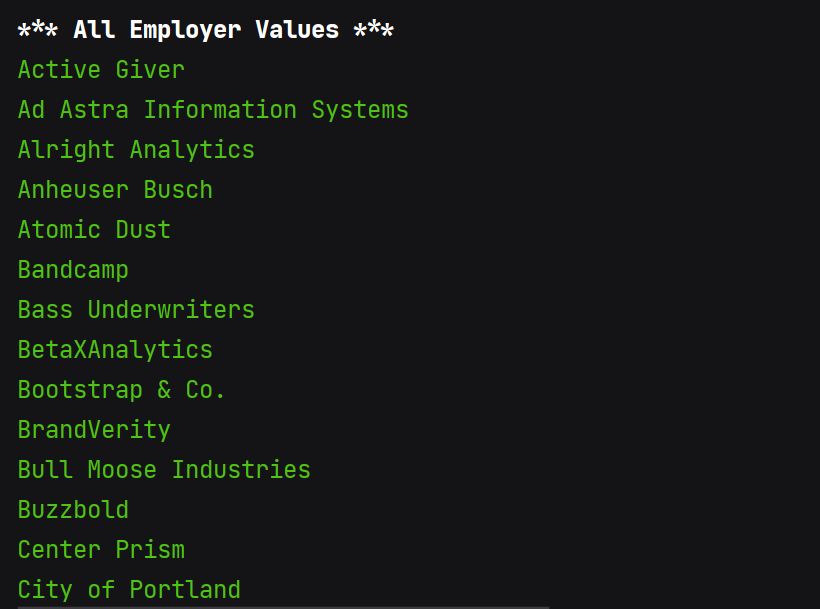

# Tech Jobs Console

This app allows the user to search for and list available IT jobs from a mock database (./resources/job_data.csv).
The app runs in the terminal/console of the user's computer.

### Technologies
- Java

### Overview
* Once the app starts. the user is prompted to select either to "Search" or "List" available jobs. 
* Selecting the "Search" option allows the user to select a field to search on. Search fields include "All", "Position Type", "Employer", "Location",
and "Skill".
* Once the user selects a field, the user can then type in a word that the app will then use to filter down the jobs.

* Selecting "List" instead of "Search" provides similar options, however upon selecting a field the app simply list all of the
unique values instead of prompting the user for a search term to base the filter.

*This was a homework assignment for LaunchCode's Lc101 (2018-2021)*

# Images
## Start menu (where the user selects how to query job data)
User selects View jobs by option #1 (List),  List option #4 (Skills)

## App displays list of skills currently in job data (sorted alpabetically)

## After user selects View jobs by option #1 (List),  List option #2 (Employer)
Displays all employers currently in job data (sorted alphabetically)

## After user selects View jobs by option #1 (List),  List option #0 (All)
Displays list of every job in job data in custom format

## User selects View jobs by option #0 (Search), Search by option #0 (all), then types in "software" as the search term

## Displays all jobs featuring the search term "software" (case insensitive)

## User selects View jobs by option #0 (Search), Search by option #3 (location), then types in "city" as the search term

## Displays all jobs with the search term "city" in the location field

